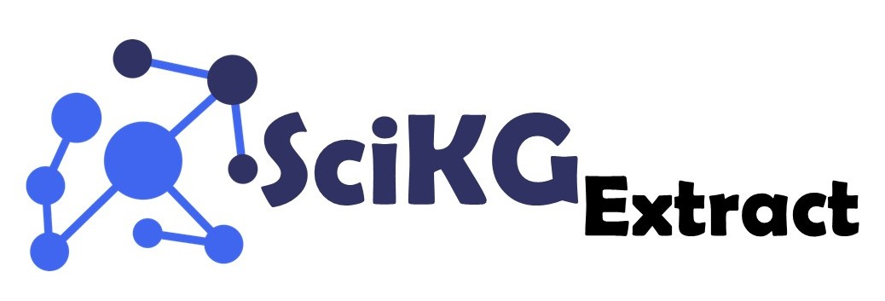

<p align="center">

</p>

<div align="center">

[](https://opensource.org/licenses/Apache-2.0)
[](https://github.com/pre-commit/pre-commit)
[](https://github.com/PyCQA/bandit)

</div>

<h3 align="center">SciKG_Extract: An Agentic Workflow for Structured Scientific Knowledge Extraction</h3>

# 📋 Overview

SciKG_Extract is a comprehensive agentic framework designed to extract structured scientific knowledge from research papers based on a semantic schema representation of the target domain. The framework leverages Large Language Models (LLMs) to interpret and extract relevant information based on a schema and incorporates various tools and techniques like JSON validation, normalization using external data sources etc. to ensure accuracy and semantic consistency of the extracted data.

# 📁 SciKG_Extract Structure

```
scikg_extract/
├── agents/                                     # LangGraph agentic workflow components
│   ├── extraction_agent.py                     # Main extraction agent orchestrator
│   └── states.py                               # State definitions for agent workflow
├── config/                                     # Configuration management
│   ├── envConfig.py                            # Environment variables and settings
│   ├── normalizationConfig.py                  # Chemical name normalization configuration
│   └── processConfig.py                        # Process-specific configurations
├── models/                                     # LLM model adapters and interfaces
│   ├── model_adapter.py                        # Base adapter interface for LLM models
│   ├── openai_adapter.py                       # OpenAI API adapter (GPT-4, GPT-3.5)
├── prompts/                                    # Prompt templates for LLM interactions
│   ├── agents/                                 # Agent-specific prompts
│   └── tools/                                  # Tool-specific prompts
│       └── structure_knowledge_extraction.py   # Prompts for structured extraction
├── services/                                   # External service integrations
│   └── pubchem_cid_mapping.py                  # PubChem API integration and CID mapping
├── tools/                                      # Tools for agent workflow
│   ├── json_cleaner.py                         # Clean and normalize JSON data
│   ├── json_validator.py                       # Validate JSON against schemas
│   ├── pubchem_normalization.py                # Normalize chemical names with PubChem
│   └── structured_knowledge_extraction.py      # Main structured extraction tool
└── utils/                                      # Utility functions and helpers
    ├── dict_utils.py                           # Dictionary utilities
    ├── evaluation_utils.py                     # Evaluation metrics and comparison tools
    ├── file_utils.py                           # File I/O operations
    ├── json_utils.py                           # JSON-specific utilities
    ├── log_handler.py                          # Logging configuration and management
    ├── rest_client.py                          # REST API client utilities
    └── string_utils.py                         # String manipulation utilities
```

# 👥 Contact and Collaboration

For questions, suggestions, or collaboration opportunities, please reach out to the project maintainers:

- **Contact**: Sadruddin Sadruddin at sameer.sadruddin [at] tib.eu
- **Issues or Bug Reports**: Please use the GitHub Issues section of this repository to report bugs or request features.

# 📃 License
This project is licensed under the Apache License 2.0. See the [LICENSE](LICENSE) file for details.
