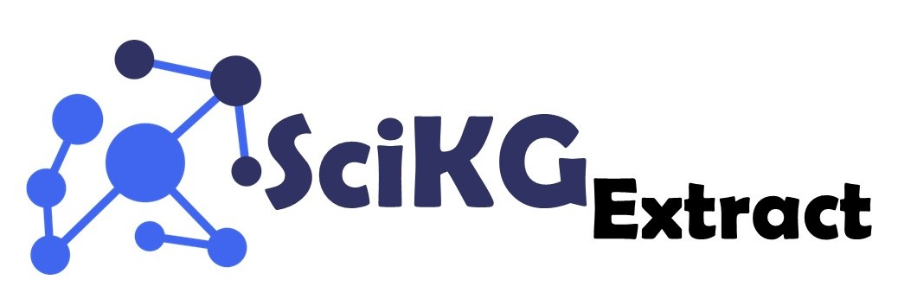

<p align="center">

</p>

<div align="center">

[](https://opensource.org/licenses/Apache-2.0)
[](https://github.com/pre-commit/pre-commit)
[](https://github.com/PyCQA/bandit)

</div>

<h3 align="center">SciKGExtract: An Agentic Workflow for Structured Scientific Knowledge Extraction</h3>

# 📋 Overview

SciKGExtract is an agentic framework for extracting structured scientific knowledge from research papers using Large Language Models (LLMs). Given a target domain described by a semantic schema, the system orchestrates a multi-stage LangGraph workflow that extracts, validates, normalizes, and iteratively refines structured JSON from scientific text.

The framework is domain-agnostic and has been applied to both **materials science** (Atomic Layer Deposition, PolyIE and PcMSP) and **biomedical NLP** benchmarks (BC5CDR and BioRED). It supports four LLM providers (OpenAI, SAIA, Ollama, HuggingFace) and six progressive extraction pipeline variants — from plain schema-constrained extraction up to multi-agent debate-style self-refinement.

# ✨ Key Features

- **Schema-driven extraction** — structured output is constrained by a user-defined JSON Schema, ensuring results conform to a domain-specific data model
- **Agentic pipeline with LangGraph** — modular workflow composed of extraction, reflection, feedback, and orchestration agents
- **Multi-provider LLM support** — unified `PROVIDER:model` interface for OpenAI, SAIA, Ollama, and HuggingFace models
- **PubChem entity normalization** — chemical compound names are resolved to PubChem CIDs via a local LMDB database for semantic consistency
- **LLM-as-a-Judge evaluation** — extracted knowledge is scored against Correctness and Completeness rubrics by one or more judge LLMs

# 🖊️ Citation

If you use SciKGExtract in your research, please cite:

```bibtex
@misc{scikgextract-2026,
  title  = {SciKGExtract: An Agentic Workflow for Structured Scientific Knowledge Extraction},
  author = {Sadruddin, Sameer and D'Souza, Jennifer},
  year   = {2026},
  url    = {https://github.com/sciknoworg/scikgextract}
}
```

> This citation will be updated with the full reference upon publication.

# 👥 Contact and Collaboration

For questions, suggestions, or collaboration opportunities, please reach out to the project maintainers.

| | |
|---|---|
| **Jennifer D'Souza** | jennifer.dsouza@tib.eu |
| **Sameer Sadruddin** | sameer.sadruddin@tib.eu |

- **Issues & Bug Reports**: [GitHub Issues](https://github.com/sciknoworg/scikgextract/issues)

# 📃 License

This project is licensed under the Apache License 2.0. See the [LICENSE](LICENSE) file for details.
